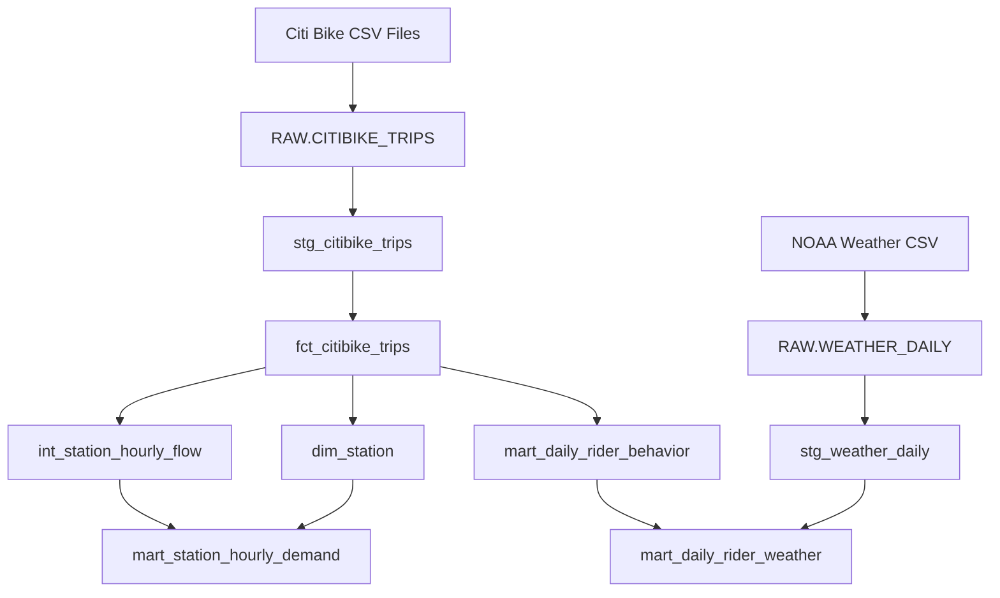
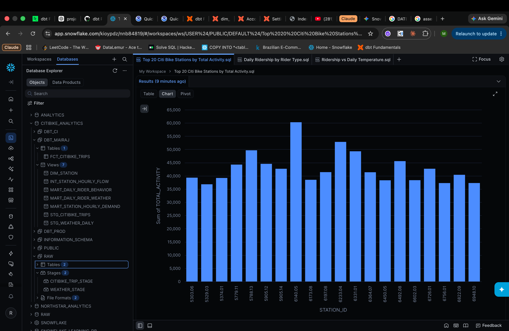
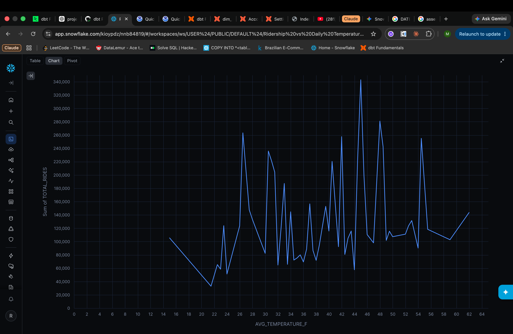

# Citi Bike Operations Analytics

An analytics engineering project built with Snowflake, dbt Core, SQL, Git, and GitHub Actions.

The project uses Citi Bike trip history and NOAA weather data to build reliable analytical models for station demand, rider behavior, and weather-related ridership patterns.

The dataset currently covers January through March 2025 and includes more than 7.3 million Citi Bike rides.

## Project Goals

I built this project around three main questions:

- Which Citi Bike stations have the highest activity and strongest inbound/outbound flow?
- How do members and casual riders differ in ride volume and duration?
- How does daily weather relate to Citi Bike ridership?

The project also focuses on the engineering behind those questions: incremental processing, testing, model design, CI, and separate development/production environments.

## Tech Stack

- Snowflake
- dbt Core
- SQL
- Git and GitHub
- GitHub Actions
- Citi Bike Trip History
- NOAA Daily Weather Data

## Data Sources

### Citi Bike

Monthly Citi Bike trip-history files are loaded into Snowflake and include:

- ride ID
- bike type
- start and end timestamps
- start and end stations
- station coordinates
- member/casual rider type

The project currently contains **7,324,003 rides** from January through March 2025.

### NOAA Weather

Daily weather data comes from NOAA's Central Park station (`USW00094728`).

The project uses:

- precipitation
- snowfall
- maximum temperature
- minimum temperature

There are 90 daily weather records covering the same January-March period.

## Architecture



The Snowflake environments are separated by purpose:

- `DBT_MAIRAJ` — local development
- `DBT_CI` — automated pull-request validation
- `DBT_PROD` — production models

## dbt Models

### `stg_citibike_trips`

Cleans and types the raw Citi Bike data while keeping the original grain of one row per ride.

This includes converting timestamps and coordinates to their proper data types and normalizing blank values.

### `fct_citibike_trips`

The main ride-level fact table.

It contains one row per ride and includes a derived `ride_duration_minutes` field.

The model is incremental and uses `ride_id` as its merge key.

### `int_station_hourly_flow`

Aggregates ride activity to:

**one station + one specific hour**

Departures and arrivals are calculated separately before being combined. The model also calculates:

`net_flow = arrivals - departures`

Positive values indicate net inbound movement, while negative values indicate net outbound movement.

### `dim_station`

Contains one row per station ID with the most recently observed:

- station name
- latitude
- longitude
- observation timestamp

Station ID is used as the key because some station names appear with small naming variations over time.

### `mart_station_hourly_demand`

A business-facing station model containing:

- station name and ID
- hourly departures
- hourly arrivals
- net flow
- total activity
- flow direction

### `mart_daily_rider_behavior`

Aggregates trips to:

**one date + one rider type**

It includes:

- total rides
- median ride duration

Median duration is used because a small number of unusually long rides can distort the average.

### `stg_weather_daily`

Cleans and types NOAA daily weather data.

### `mart_daily_rider_weather`

Combines daily rider behavior with weather data while preserving the date + rider type grain.

This allows ridership to be compared with temperature, precipitation, and snowfall.

## Incremental Processing

`fct_citibike_trips` is maintained as a dbt incremental model using Snowflake `MERGE`.

The model uses:

```text
unique_key = ride_id
incremental_strategy = merge
```

It also reprocesses a two-day ingestion lookback window rather than only processing rows newer than the exact maximum `loaded_at`.

This provides additional protection around recent or late-arriving records while the merge key prevents duplicate rides.

For historical rebuilds or recovery, the fact can be fully rebuilt with:

```bash
dbt run --select fct_citibike_trips --full-refresh
```

## Data Quality

The project uses dbt tests to protect model grain and business rules.

Examples include:

- unique and non-null `ride_id`
- unique station IDs in `dim_station`
- unique station + hour combinations
- unique date + rider type combinations
- accepted rider types (`member`, `casual`)
- accepted station flow classifications
- non-negative ride durations
- unique station + weather date combinations

A reconciliation test also checks that the row count in `stg_citibike_trips` matches the incremental ride fact.

Custom singular tests are written so that returning zero rows means the test passes.

## CI and Production

GitHub Actions is used for automated dbt validation.

When a pull request is opened against `main`, the CI workflow:

1. checks out the repository
2. installs Python and dbt
3. reads Snowflake credentials from GitHub Secrets
4. connects to the `DBT_CI` schema
5. runs `dbt build`

Production uses a separate GitHub Actions workflow and the `DBT_PROD` schema.

The production workflow can be triggered manually or on a schedule and runs:

```bash
dbt build --target prod --profiles-dir .github
```

This keeps development, CI, and production models isolated from one another.

Raw CSV ingestion is currently manual; GitHub Actions automates the dbt transformation and testing layer after source data is available in Snowflake.

## Results

### Highest-Activity Stations



The station-demand mart makes it easy to rank stations by total observed activity using arrivals plus departures.

A station can have high overall activity while having relatively low total net flow because inbound and outbound movement can offset over time.

### Member vs Casual Ridership


Daily ride totals can be compared directly between Citi Bike members and casual riders.

### Ridership and Temperature



Daily weather observations are combined with total ridership to explore the relationship between temperature and Citi Bike demand.

This is an observational relationship and does not imply that temperature alone causes changes in ridership.

## Example Query

```sql
select
    station_id,
    station_name,
    sum(total_activity) as total_activity,
    sum(departures) as total_departures,
    sum(arrivals) as total_arrivals,
    sum(net_flow) as net_flow
from CITIBIKE_ANALYTICS.DBT_PROD.MART_STATION_HOURLY_DEMAND
group by
    station_id,
    station_name
order by total_activity desc
limit 20;
```

## Project Structure

```text
citibike-analytics/
├── .github/
│   ├── profiles.yml
│   └── workflows/
├── docs/
│   └── images/
├── models/
│   ├── staging/
│   ├── intermediate/
│   └── marts/
├── tests/
├── dbt_project.yml
└── README.md
```

## Limitations

Citi Bike trip history records completed rides, not live station inventory.

Because of that, this project cannot directly determine:

- whether a station became empty
- whether all docks became full
- bike battery status
- broken-bike status
- rebalancing vehicle routes
- kiosk or network outages

`net_flow` measures observed ride movement, not actual station inventory.

Weather is represented by one Central Park station and is treated as a city-level daily weather approximation.

The current dataset only covers January through March 2025, so it does not capture a full year of seasonal behavior.

## Running Locally

Create and activate a virtual environment:

```bash
python3 -m venv .venv
source .venv/bin/activate
```

Install dbt:

```bash
pip install dbt-core==1.12.2 dbt-snowflake==1.12.0
```

Configure your Snowflake connection in:

```text
~/.dbt/profiles.yml
```

Then verify the connection:

```bash
dbt debug
```

Build and test the project:

```bash
dbt build
```